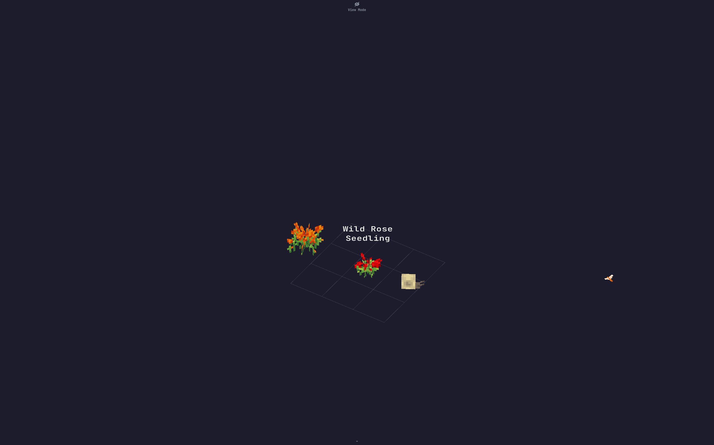

# Eden
A simple gardening simulator!
## About

### Description
Eden, formerly "Mind Gardens", is a simple gardening simulator with charming 3D pixel art graphics, and beautiful ambiance effects. Tend to your garden and grow flowers, the game was designed to provide a calming experience. You might even get surprise visits from a snails!
  
Features:

* Real-time particle effects such as rain and dirt particles
* Background music and ambiance effects, such as birds, dragonflies and snails
* Flowers come in three stages, watch your flower babies grow up and mature!
* Balance the mood in your garden, by managing the 'Hapiness', 'Calmness' and 'Energy' levels of your garden. Each flower affects the mood, so plant carefully!
* Water and prune flowers to keep them happy
* Harvest blosomming flowers and wild flowers to get new seeds!
* Keep your garden clean, and avoid overcrowding by removing weeds
* View mode allows you to admire your garden without worrying about plant growth, thirst, pruning and weeds!
* Read about plant information: name, scientific name and mood affecting attributes

Some info:
* Controls are given in the main menu
* Moving your mouse to the edge of the screen allows you to pan the camera
* Read about the status of your flowers by hovering over them, their status is shown in the bottom center
* Keep the flowers watered and pruned, be sure not to overwater!
* Use the 'watering can' item in your inventory to water your plants
* Use the 'shears' item to prune your plants
* Use the 'hoe' item to remove weeds or any unwanted flowers, overcrowding is bad for flowers
* Harvest blossoming flowers with the hoe to get more seeds
* Read about the information of a flower by toggling the info with 'I'. Information about the mood effects of a flower is shown, along with its scientific name
* Manage the mood of your garden via the indicator at the top center

### Technology
* Unity: Game engine to run the simulation
* C#: Backend logic
## Getting Started
### Deployment
Download instructions for users (for Windows only):
1. Download [Release1.0.0.zip](https://github.com/AustinKong/mind-gardens/releases/tag/v1.0.0)
2. Unzip Release1.0.0.zip
3. Run Eden.exe
### Dependencies
* Unity
### Installation
Installation and setup instructions for developers:
1. Install Unity Hub
2. Install Unity version 2019.4.33f1 or recommended LTS
3. Fork and clone the repository
4. Start coding and build something awesome!
### Contributing
This project is no longer under active development. Suggestions, issues and bug reports will not be actively resolved. However, pull requests and forks are always welcome!
## Help
### Controls
	Alt + F4 - Quit
	Left mouse button - Use selected item
	Middle mouse button (Scroll wheel) - Zoom in/out
	I - Toggle flower info (Flower name, scientific name & flower mood affecting attributes)
	Left/right arrow keys - Cycle inventory
	V - Toggle viewing mode (pauses game)
	F - Toggle fast forward (x1, x2, x4)
	
## Authors
* Art & Programming - Austin Kong [@AustinKong](https://github.com/AustinKong)
* Music & SFX - Joseph Tan [@Hosef](https://github.com/Hosef99)
## License
This project is licensed under MIT license. View license in [license.txt](license.txt)
